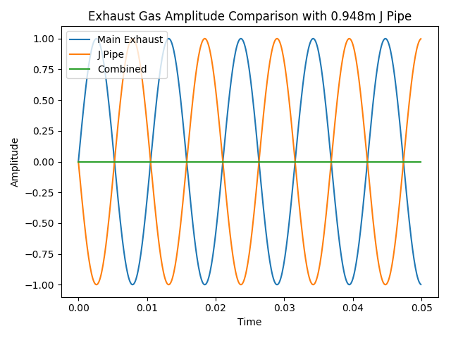
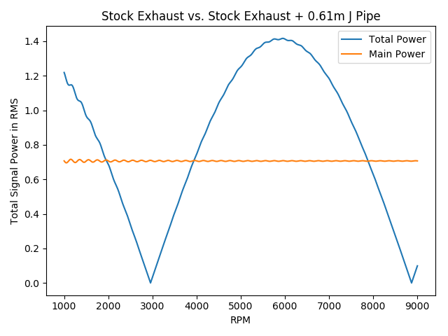

# Investigation on Installing J-Pipe to Reduce Drone

# Introduction
About a year ago, I started working on my Mustang. The exhaust was way too quite, so I started swapping stock parts to 
aftermarket offerings. The complete list of current mod includes:
- Roush cold air intake
- Ford Racing after-cat X-Pipe
- Dual 18" glasspack
- Roush cat-back exhaust
- BAMA tune

After all the modification, the car sounds a lot more engaging and lively. However, with the modifications, the cabin
 starts to drone at some specific RPMs. 
 
 # What is "Drone"?
 Droning is a phenomenon of the car resonating with exhaust gas's frequency. It usually happens at highway cruising 
 speed. When it happens, you can feel the your cabin is vibrating at a low frequency.
 
 # How does J-Pipe help?
 J-Pipe is a "J" shaped pipe, with one end connected to the main exhaust system, and another end closed off. It allows soundwave to travel inside and bounce back, destructively interfering with the exhaust soundwave, thus canceling the power in the signal at the specific frequency.
 
 J Pipe will usually look like this,
 
 
It will attach to the main exhaust system. Usually, it is more desirable for it to be attached as close to the engine as possible, so that the destructive interference can happen as early as possible.
 
 # How to Calculate J-Pipe Length?
 You need to know:
 - RPM at which the drone happens
 - Your car's cylinder count
 - Speed of sound

```
Drone Frequency = (RPM / 60) * (Cylinder / 2)
J Pipe Length = 1/4 * (speed of sound / Drone Frequency)
```

Or, you can punch in those number in the python script, and it will calculate the length for you.
```
hr = HelmholtzResonator(exhaust_temp=50, cylinder_count=6, drone_rpm=1900)
opt_j_pipe = hr.calculate_optimal_j_pipe_length()
```

# Analysis
## Adding an ideal J-Pipe
I found the optimal length for J-pipe for my car would be around 0.9m (33 inch), and I ran some simulation to visualize the effect.


Adding a 33 inch J-pipe will completely cancel out the soundwave.

## How does J-Pipe affect other frequencies?
Unfortuanately, I was not able to find a 33 inch J-Pipe off the shelf; the longested J-Pipe I was able to find is from NoDrone in 24 inch. So I wanted to investigate on how effective would the 24 inch J-Pipe be.

The following plots compares the total power of the signal, before and after the 24 inch J-Pipe.


The total power is calculated as the Root Mean Square of the soundwave, 
```
Power = np.sqrt(np.mean(x **2))
```
We can see that, with the introduction of a 24 inch J-Pipe, the total power of the signal is minimized at around 3000 RPM, while minimal reduction is observed at 1900 RPM, which is where my drone happens. Simply put, a 24 inch J-Pipe would not be able to solve my problem. I'd have to find a shop to customize it for me.

# Future Work
Now I just need to figure out how to fit two 33 inch stainless steel pipes under my car... Wish me luck.
